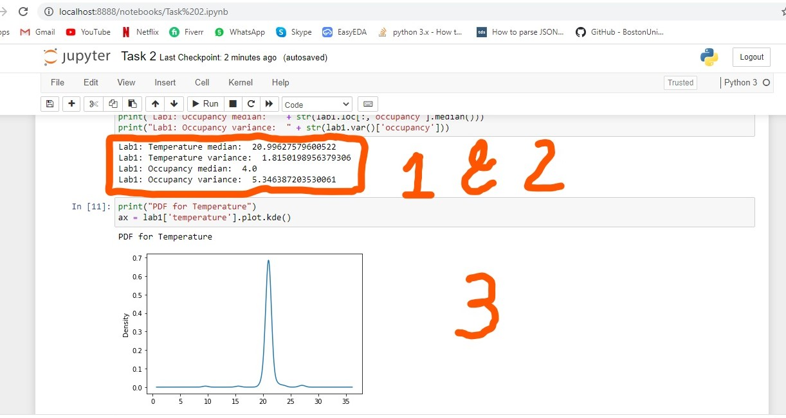
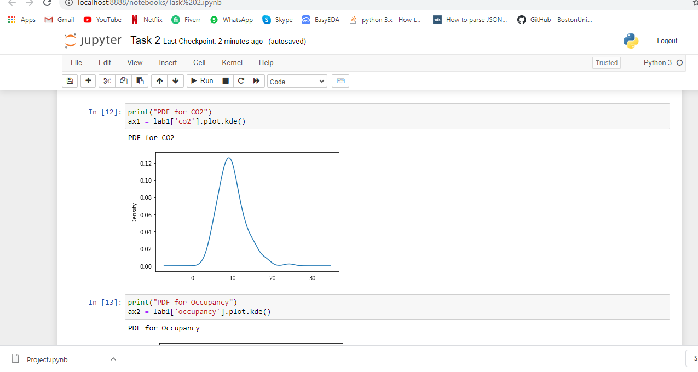
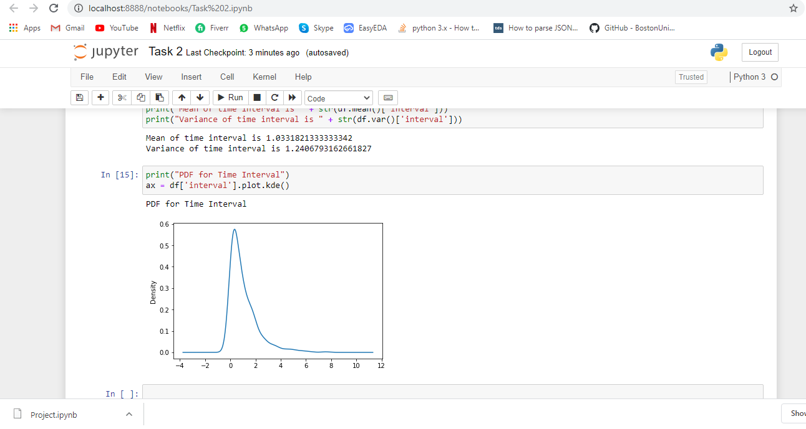
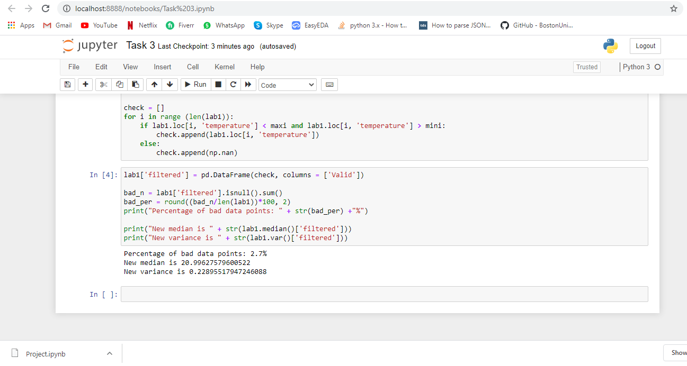

# Overview
The Fall 2020 sensor miniproject was based on the simulation of internet-connected sensors. Simulated sensors are used to test proposed designs against impairments including delayed, missing or incorrect data. The IoT simulator consists of a Websockets server that emits data packets with random timing to the backend client.
# Procedure

## Platforms used in this Project
* Ubuntu Terminal (WSL)
* Jupyter Notebook
* Pandas and NumPy was used in task 2 & 3
## Task 0 
First I cloned the MiniProject2020 repository from github. Then I created the IoT server using server.py. After this created the client using client.py. Both codes were run simultaneously for a considerably longer time and data packets for three different rooms were collected containing the following information
1. Room
2. CO2
3. Occupancy
4. Temperature
5. Time
### Task 1
The data packets being recieved were in JSON format were stored in a .Json file, by adding the following lines of code in client.py file

Then data was saved in the following format

## Task 2
For the first three questions of task 2, the room **Lab1** was selected. Answer to all the four questions of task2 were obtained using the code provided in **Task2.py**

## Task 3
We were asked to remove all the bad **Temperature Data Points** from the room selected in Task2. I did so by letting go off all the data points outside two standard deviation from the mean temperature. The new median and variance were calculated by using the remain valid data points.

Also, a persistent change in temperature doesn't always indicate a fualty sensor. It might be that the temperature is actually changing.
# Conclusion
* As the simulation generates truly random sensor values at random time intervals for three rooms but in random order which depicts the behaviour of the real world.
* First of all this simulation is deficient of **Real Hardware** (Hence the name simulation). It fails to account for the probability of any sensor being faulty or not working at all. What kind of data would be recieved in that scenario? 
* Python Websockets library is far more easy to use as compared to C++ Websockets. There are many in-built which saves time and brains which we had to write in C++. 
* In my opinion, the latter option is better because it incorporates the urgency and the very purpose of IoT. If the server was polling the sensors after a set amount of time, there will always be a bigger load while retrieving the data from the sensors.
